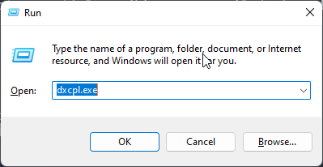
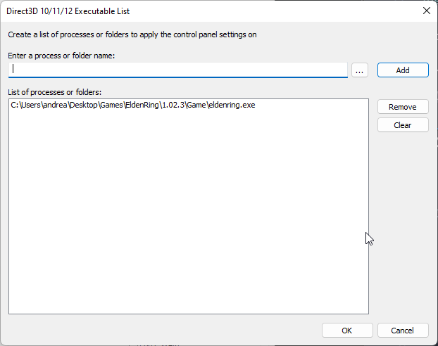
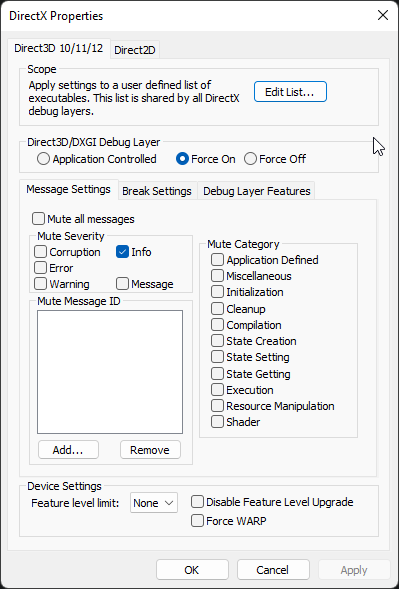

# Troubleshooting / FAQ

## My game crashes

- Always start with a clean zip of the latest release.
- EAC needs to be [bypassed](https://wiki.speedsouls.com/eldenring:EAC_Bypass). Do [this](#i-cant-bypass-eac).
- Wait for the main menu of the game to appear before launching the tool.
- If you are running in [fullscreen](https://github.com/veeenu/eldenring-practice-tool/issues/23), try borderless or windowed mode.
- Make sure you have the latest version of your GPU drivers.
- Antivirus software and old Windows versions will interact [poorly](#is-this-safe-to-run) with the tool. Turn them off.
- If all else fails, [submit an issue](#i-found-an-issue-what-do-i-do).

## Is this safe to run?

The tool employs some techniques that are usually typical of malware, such as process manipulation,
DLL injection and detouring. It needs to do so to interact with the Elden Ring process.

As a result, antiviruses and scans will raise all sorts of red flags.

Don't worry, the tool is completely safe! The source code is fully available and auditable in this repository.

Getting a code signing certificate could mitigate this, but it is very expensive. Please
consider [supporting the project](https://www.patreon.com/johndisandonato).

If you don't want to trust the published binaries, you can [compile the tool from sources](CONTRIBUTING.md)
yourself.

## "Inaccessible target process", "Could not find process"

- You have not disabled EAC correctly. Do [this](#i-cant-bypass-eac).
- You have not closed your antivirus. Close it.

## I can't bypass EAC

Follow these steps:

- Make [Windows extensions visible](https://www.howtogeek.com/205086/beginner-how-to-make-windows-show-file-extensions/).
- Make sure that `steam_appid.txt` has the correct name (it could be called `steam_appid.txt.txt`).
- Make sure that `steam_appid.txt` contains _only_ the value:
  ```
  1245620
  ```
- Make sure that you are launching `eldenring.exe` by double clicking it directly.

This method is the only one officially supported.

## I found an issue. What do I do?

- Apply the following settings to `jdsd_er_practice_tool.toml`:
  - `log_level = "TRACE"` 
  - `dxgi_debug = true`
- Enable DXGI debug layer:
  - Install Microsoft's [graphics diagnostic tools](https://docs.microsoft.com/en-us/windows/uwp/gaming/use-the-directx-runtime-and-visual-studio-graphics-diagnostic-features).
  - Press `Windows + R` to open the "Run" dialog, type `dxcpl.exe` and press enter.
    
    
  - Click `Edit List...`, then `Add`, then find the path to `eldenring.exe` and select it.
  
    
  - Select `Force On` under `Direct3D/DXGI DebugLayer`.
  
    
  - (Once you're done troubleshooting, you can revert these steps by selecting `Application Controlled` again and
    then removing `eldenring.exe` from the list).
- Reproduce the steps tha cause your bug.
- Go [here](https://github.com/veeenu/eldenring-practice-tool/issues/new) and submit a new issue:
  explain the problem, compress the `jdsd_er_practice_tool.log` file, and attach it.

I'll do my best to get back to you and fix the bug.

While troubleshooting bugs, I may ask you to use the [nightly release](https://github.com/veeenu/eldenring-practice-tool/releases/tag/nightly)
instead of the latest stable release. This is an automated release with the very latest changes,
intended for faster issues feedback cycles. Don't use it otherwise!

## How can I change the key bindings?

You can customize the default ones or add your own by editing
`jdsd_er_practice_tool.toml` with your favorite text editor.

The bundled file contains all possible settings with predefined hotkeys and is
mostly self-explanatory.

You can find a list of supported hotkey codes [here](https://github.com/veeenu/practice-tool-core/blob/2960d851005ca0edaf030472cdddd3c992f077f9/src/key.rs#L7-L151).

Valid combinations are:
- Individual keys: `"tab"`, `"left"`
- Keys with up to 3 modifiers, separated by `+`: `"ctrl+x"`, `"alt+1"`, `"ctrl+rshift+alt+q"`.
  Valid modifiers are:
  - `ctrl`, `shift`, `alt`, `super` (bilateral)
  - `lctrl`, `lshift`, `lalt`, `lsuper` (left variant)
  - `rctrl`, `rshift`, `ralt`, `rsuper` (right variant)

## What versions of the game are supported?

All of them! When new patches come out, a new release with compatibility will be drafted as soon as possible.

## Will I get banned if I use this online?

Use at your own risk. Bans are unlikely, but in doubt, make backups of your savefiles and only use the tool offline.
By using the tool, you agree that I will not be held liable for any bans or unintended side effects resulting from the usage of the tool.

## I want to talk to you!

You can contact me on [my Discord server](https://discord.gg/jCVjxjHZ).
Please use the [Practice Tool help channel](https://discord.com/channels/267623298647457802/996101875214585867)
if you have questions about the Practice Tool.

## I want to watch your speedruns!

Sure! See you over here 👉 [https://twitch.tv/johndisandonato](https://twitch.tv/johndisandonato)!

# Known issues

## Stake of Marika instant quitouts (Issue: https://github.com/veeenu/eldenring-practice-tool/issues/6)

If you use the *instant quitout* feature in a Stake of Marika area while dying, the usual choice dialog will pop up.
If you choose "Stake of Marika", you will spawn dead. If you choose "Last visited Grace", you will
instantly quitout instead, as requested.

Always choose the Grace. Hopefully, in the future, a workaround will be found.

## Character rotation in teleportation function (Issue: https://github.com/veeenu/eldenring-practice-tool/issues/15)

When saving/loading position, the character doesn't retain rotation appropriately as the rotation
assignment algorithm is rather enigmatic. Loading the position many times will make the rotation
converge to the intended one.

## Spawning on horseback deathcam oddity (Issue: https://github.com/veeenu/eldenring-practice-tool/issues/5)

If you spawn on horseback, the `deathcam` flag will not work properly at first.
It will just lock the camera in place. It is enough to get off the horse and then the
flag should work as intended again. If it doesn't work, a quitout will most likely fix it.
